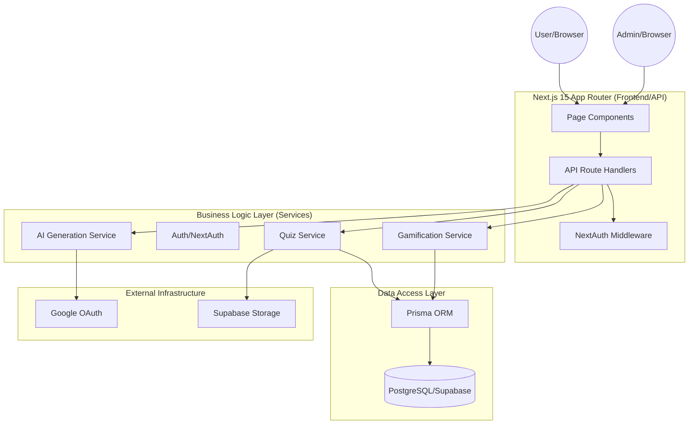

# System Architecture

This document provides a high-level overview of the Sports Trivia Platform's architecture, data flows, and core design principles.

## Core Architectural Insight

The platform follows a **Services-First** pattern within a Next.js App Router environment. Business logic is strictly decoupled from Route Handlers and Server Components into a dedicated `lib/services` layer. This ensures that logic for scoring, attempt validation, and gamification is reusable across API endpoints, background tasks, and server-side rendering.

### Comparison: TypeScript vs Python Service Pattern

In this codebase, a service like `QuizService` (TypeScript) leverages Prisma's type safety:
```typescript
// lib/services/quiz.service.ts
export const getQuiz = async (id: string) => {
  return await prisma.quiz.findUnique({
    where: { id },
    include: { questions: true }
  });
};
```

In a traditional Python/FastAPI environment, you might use a similar Repository pattern with SQLAlchemy:
```python
# services/quiz_service.py
def get_quiz(db: Session, quiz_id: str):
    return db.query(models.Quiz).filter(models.Quiz.id == quiz_id).first()
```

## System Overview (Mermaid)



## Key Modules

### 1. Presentation Layer (`app/`)
- **Public**: `/quizzes`, `/topics`, `/leaderboard`.
- **Authenticated**: `/profile`, `/friends`, `/challenges`.
- **Admin**: `/admin/*` (Protected by `requireAdmin` role check).

### 2. API Layer (`app/api/`)
- ~70 Route Handlers categorized into:
    - `public/`: No auth required.
    - `player/`: Session required.
    - `admin/`: Admin role required.
    - `ai/`: Content generation tasks.

### 3. Business Logic Layer (`lib/services/`)
- [quiz.service.ts](file:///Users/sahilmehta/sportstrivia-2/lib/services/quiz.service.ts): Quiz lifecycle, scoring, and attempts.
- [gamification.service.ts](file:///Users/sahilmehta/sportstrivia-2/lib/services/gamification.service.ts): Badge awarding, levels, and streaks.
- [topic.service.ts](file:///Users/sahilmehta/sportstrivia-2/lib/services/topic.service.ts): Hierarchical topic lookups (with in-memory caching).
- [slug.service.ts](file:///Users/sahilmehta/sportstrivia-2/lib/services/slug.service.ts): Unique URL generation with memoization.

### 4. Data Layer (`prisma/`)
- **Schema**: [schema.prisma](file:///Users/sahilmehta/sportstrivia-2/prisma/schema.prisma) defines 23+ models.
- **Migrations**: Standard Prisma migration flow.
- **Seeding**: Comprehensive seed data including hierarchical topics and sample content.

## Design Tradeoffs

1. **In-Memory Caching vs Redis**: For the current scale, topic hierarchies and slugs are cached in-memory with TTLs ([topic.service.ts](file:///Users/sahilmehta/sportstrivia-2/lib/services/topic.service.ts)). This reduces latency significantly without the overhead of an external cache.
2. **Server-Side Validation (Zod)**: All inputs are strictly validated at the API boundary using Zod schemas ([lib/validations/](file:///Users/sahilmehta/sportstrivia-2/lib/validations/)).
3. **Soft Deletes vs Hard Deletes**: The system uses hard deletes for most transient entities but maintains referential integrity through Prisma's `onDelete: Cascade` or custom safety checks (e.g., in `topic.service.ts`).

## Reading Order for New Developers

1. [QUICK_START.md](file:///Users/sahilmehta/sportstrivia-2/docs/QUICK_START.md): Get the app running.
2. [sportstrivia.md](file:///Users/sahilmehta/sportstrivia-2/docs/sportstrivia.md): Understand the product goals.
3. [schema.prisma](file:///Users/sahilmehta/sportstrivia-2/prisma/schema.prisma): Study the domain model.
4. [API_REFERENCE.md](file:///Users/sahilmehta/sportstrivia-2/docs/API_REFERENCE.md): See how the frontend talks to the backend.
