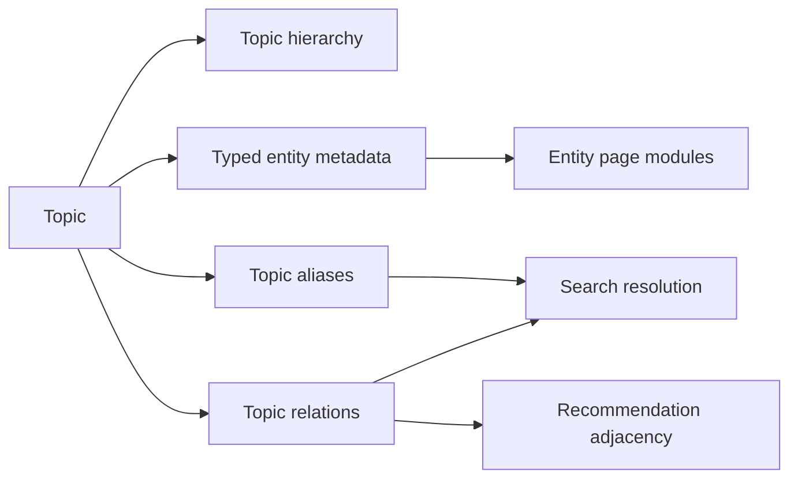

# Topic Entity Graph Technical Spec

**Source PRD**: `docs/features/topic-entity-graph-prd.md`  
**Date**: 2026-03-22  
**Status**: Active (Partially Implemented)  
**Owner**: Product + Platform

## 1. Purpose

This spec turns the `Topic` model into a production-grade entity graph for discoverability without replacing the existing taxonomy model.

The implementation goal is to make `Topic` reliable enough to power:
- sport hubs
- team, athlete, tournament, and organization pages
- typed search resolution
- followable entities
- recommendation adjacency

This is an implementation spec, not a concept document. It defines concrete schema changes, service contracts, rollout sequence, and migration rules.

## 2. Current State

### What already exists
- `Topic` already supports hierarchy, `schemaType`, `schemaCanonicalUrl`, `schemaSameAs`, and `schemaEntityData`.
- `TopicSchemaType` already distinguishes:
  - `SPORT`
  - `SPORTS_TEAM`
  - `ATHLETE`
  - `SPORTS_ORGANIZATION`
  - `SPORTS_EVENT`
- Admin APIs already validate and persist typed entity data through `parseTopicEntityData()`.
- Public topic APIs already expose typed metadata.

### Current constraints
- Alias handling is inconsistent and buried inside `schemaEntityData` for only some types.
- There is no explicit topic-to-topic relation model.
- Entity metadata is too shallow for search and recommendation use cases.
- There is no entity-readiness computation that downstream services can trust.

### Explicit non-goal
Do not split entities into separate `Team`, `Athlete`, `Tournament`, and `Organization` tables in v1.

## 3. Decisions

### D1. Keep `Topic` as the canonical entity backbone
`Topic` remains the source of truth for all discoverability entities.

### D2. Keep current enum names in v1
Do not rename `SPORTS_TEAM` to `TEAM` or `SPORTS_EVENT` to `TOURNAMENT` in the Prisma enum yet. Renaming the enum now creates migration churn with little product value.

Semantic mapping for product/UI use:
- `SPORT` -> Sport
- `SPORTS_TEAM` -> Team or Nation
- `ATHLETE` -> Athlete
- `SPORTS_EVENT` -> Tournament/Event
- `SPORTS_ORGANIZATION` -> Organization

### D3. Move aliases out of JSON into a top-level field
Aliases are needed across all entity types for search, follows, and canonical resolution. They should not live inside `schemaEntityData`.

### D4. Add an explicit relation table
Hierarchy remains useful for browsing. Cross-entity semantics must be modeled separately.

### D5. V1 relations represent current state only
Do not model historical memberships, date-ranged relations, or seasonal validity in v1.

### D6. `entityStatus` semantics are split by consumer
In current implementation:
- `entityStatus` is an operational/admin quality signal overall.
- follows and explicit interests enforce `entityStatus = READY` as a hard gate.
- onboarding interest precheck for sports also requires `entityStatus = READY`.
- search remains allowed to treat `entityStatus` as a ranking/quality signal rather than universal hard exclusion.

### D7. Target the current Prisma/Postgres stack explicitly
This spec should be implemented against the current application stack. Search-related decisions should assume the existing Prisma/Postgres-backed architecture, not a future dedicated search system.

## 4. Target Architecture



## 5. Schema Changes

## 5.1 Prisma changes

### `Topic`
Add the following fields:

```prisma
model Topic {
  id                    String          @id @default(cuid())
  name                  String          @unique
  slug                  String          @unique
  description           String?
  seoTitle              String?
  seoDescription        String?
  seoKeywords           String[]
  schemaType            TopicSchemaType @default(NONE)
  schemaCanonicalUrl    String?
  schemaSameAs          String[]
  schemaEntityData      Json?
  alternateNames        String[]        @default([])
  entityStatus          TopicEntityStatus @default(DRAFT)
  entityValidatedAt     DateTime?
  displayEmoji          String?
  displayImageUrl       String?
  parentId              String?
  level                 Int             @default(0)
  order                 Int             @default(0)
  createdAt             DateTime        @default(now())
  updatedAt             DateTime        @updatedAt
  outgoingRelations     TopicRelation[] @relation("TopicRelationFrom")
  incomingRelations     TopicRelation[] @relation("TopicRelationTo")

  @@index([schemaType])
  @@index([entityStatus])
}
```

New enum:

```prisma
enum TopicEntityStatus {
  DRAFT
  READY
  NEEDS_REVIEW
}
```

Notes:
- `alternateNames` is the normalized alias array used for search and matching.
- `entityStatus` is operational readiness, separate from SEO content state.
- v1 does not add a stored notes field; validation details are computed by the readiness service.

### `TopicRelation`

```prisma
model TopicRelation {
  id           String            @id @default(cuid())
  fromTopicId  String
  toTopicId    String
  relationType TopicRelationType
  createdAt    DateTime          @default(now())
  updatedAt    DateTime          @updatedAt
  fromTopic    Topic             @relation("TopicRelationFrom", fields: [fromTopicId], references: [id], onDelete: Cascade)
  toTopic      Topic             @relation("TopicRelationTo", fields: [toTopicId], references: [id], onDelete: Cascade)

  @@unique([fromTopicId, toTopicId, relationType])
  @@index([fromTopicId, relationType])
  @@index([toTopicId, relationType])
}
```

Enums:

```prisma
enum TopicRelationType {
  BELONGS_TO_SPORT
  PLAYS_FOR
  REPRESENTS
  COMPETES_IN
  ORGANIZED_BY
  RIVAL_OF
  RELATED_TO
}
```

## 5.2 Entity metadata contracts

`schemaEntityData` remains in place, but its contents become stricter and more useful.

### `SPORT`
```ts
{
  governingBodyName?: string | null;
  governingBodyUrl?: string | null;
  region?: string | null;
}
```

### `SPORTS_TEAM`
```ts
{
  sportName?: string | null;
  country?: string | null;
  leagueName?: string | null;
  leagueUrl?: string | null;
  organizationName?: string | null;
  organizationUrl?: string | null;
  foundedYear?: number | null;
}
```

### `ATHLETE`
```ts
{
  sportName?: string | null;
  nationality?: string | null;
  birthDate?: string | null;
  activeStartYear?: number | null;
  activeEndYear?: number | null;
}
```

### `SPORTS_ORGANIZATION`
```ts
{
  sportName?: string | null;
  region?: string | null;
  country?: string | null;
}
```

### `SPORTS_EVENT`
```ts
{
  sportName?: string | null;
  eventKind?: "TOURNAMENT" | "LEAGUE" | "SEASON" | "CUP" | null;
  startDate?: string | null;
  endDate?: string | null;
  country?: string | null;
  locationName?: string | null;
  locationUrl?: string | null;
  organizerName?: string | null;
  organizerUrl?: string | null;
  frequency?: "ANNUAL" | "SEASONAL" | "ONE_OFF" | "IRREGULAR" | null;
}
```

## 5.3 Validation rules

### Shared rules
- `alternateNames` must be normalized to trimmed, unique, case-insensitive distinct values.
- `alternateNames` cannot contain the canonical `name` duplicate.
- `schemaCanonicalUrl` remains required for all non-`NONE` schema types.
- `NONE` topics cannot have relations.
- Self-relations are invalid except `RELATED_TO` if explicitly allowed later. V1: reject all self-relations.
- `alternateNames` are optional metadata for search and resolution, not a readiness dependency.

### Readiness rules
A topic can be marked `READY` only if:
- `schemaType !== NONE`
- `schemaCanonicalUrl` exists
- `schemaEntityData` passes type validation
- exactly one valid `BELONGS_TO_SPORT` relation exists for non-sport entities

## 6. Service Design

## 6.1 Files to add

- `lib/topic-graph/relation-types.ts`
- `lib/topic-graph/entity-contracts.ts`
- `lib/topic-graph/validation.service.ts`
- `lib/topic-graph/topic-graph.service.ts`
- `lib/topic-graph/topic-relation.service.ts`
- `lib/topic-graph/topic-readiness.service.ts`

## 6.2 Existing files to extend

- `lib/topic-schema.ts`
- `lib/topic-schema-options.ts`
- `app/api/admin/topics/route.ts`
- `app/api/admin/topics/[id]/route.ts`
- `app/api/topics/route.ts`
- `lib/services/topic.service.ts`

## 6.3 Service responsibilities

### `validation.service.ts`
- parse and validate `schemaEntityData`
- normalize aliases
- validate allowed relation pairs
- compute readiness errors and warnings

### `topic-relation.service.ts`
- create, update, delete relations
- enforce relation uniqueness
- enforce allowed type pairings

### `topic-readiness.service.ts`
- compute `isReady`, `errors`, `warnings`, and `score`
- persist `entityStatus` and `entityValidatedAt`

### `topic-graph.service.ts`
- resolve entity with outgoing/incoming relations
- fetch related entities by relation type
- expose adjacency for search/recommendations

## 7. Relation Semantics

V1 allowed relation matrix:

| From | Relation | To |
|---|---|---|
| `SPORTS_TEAM` | `BELONGS_TO_SPORT` | `SPORT` |
| `ATHLETE` | `BELONGS_TO_SPORT` | `SPORT` |
| `SPORTS_EVENT` | `BELONGS_TO_SPORT` | `SPORT` |
| `SPORTS_ORGANIZATION` | `BELONGS_TO_SPORT` | `SPORT` |
| `ATHLETE` | `PLAYS_FOR` | `SPORTS_TEAM` |
| `ATHLETE` | `REPRESENTS` | `SPORTS_TEAM` |
| `SPORTS_TEAM` | `COMPETES_IN` | `SPORTS_EVENT` |
| `SPORTS_EVENT` | `ORGANIZED_BY` | `SPORTS_ORGANIZATION` |
| `SPORTS_TEAM` | `RIVAL_OF` | `SPORTS_TEAM` |
| Any typed entity | `RELATED_TO` | Any typed entity |

Rules:
- `RIVAL_OF` should be stored as two directed rows in v1 for simplicity.
- `BELONGS_TO_SPORT` is mandatory and singular for every non-sport entity in v1.
- `PLAYS_FOR` and `REPRESENTS` are both allowed because club and nation relationships are not interchangeable.
- relations represent current-state truth only. When the real-world relationship changes, the row should be updated rather than retained historically.

## 8. API Changes

## 8.1 Admin APIs

### Extend `POST /api/admin/topics`
Accept:
```json
{
  "name": "Mumbai Indians",
  "slug": "mumbai-indians",
  "schemaType": "SPORTS_TEAM",
  "schemaCanonicalUrl": "https://example.com/mumbai-indians",
  "alternateNames": ["MI", "Mumbai Indians IPL"],
  "schemaEntityData": {
    "sportName": "Cricket",
    "country": "India",
    "foundedYear": 2008
  }
}
```

### Extend `PATCH /api/admin/topics/[id]`
Support:
- `alternateNames`
- `entityStatus`
- relation mutations only through dedicated relation API, not inline JSON blobs

### New relation APIs
- `GET /api/admin/topics/[id]/relations`
- `POST /api/admin/topics/[id]/relations`
- `PATCH /api/admin/topics/[id]/relations/[relationId]`
- `DELETE /api/admin/topics/[id]/relations/[relationId]`
- `GET /api/admin/topics/[id]/readiness`

`POST /api/admin/topics/[id]/relations` body:
```json
{
  "toTopicId": "clx123",
  "relationType": "BELONGS_TO_SPORT"
}
```

## 8.2 Public APIs

### Extend `GET /api/topics`
Return:
- `alternateNames`
- `entityStatus`

Do not add relation summaries to the bulk list route in v1. Keep relation reads on dedicated detail endpoints to avoid unstable payload size and query cost.

### New topic detail relation endpoint
- `GET /api/topics/[slug]/relations`

Response shape:
```json
{
  "topic": {
    "id": "...",
    "slug": "mumbai-indians",
    "schemaType": "SPORTS_TEAM",
    "alternateNames": ["MI"],
    "entityStatus": "READY"
  },
  "relations": {
    "belongsToSport": [{ "id": "sport-topic-id", "name": "Cricket", "slug": "cricket" }],
    "competesIn": [{ "id": "event-topic-id", "name": "Indian Premier League", "slug": "ipl" }],
    "rivals": [{ "id": "team-topic-id", "name": "Chennai Super Kings", "slug": "csk" }]
  }
}
```

## 9. Search Contract Changes

V1 search consumers should use:
- `name`
- `alternateNames`
- `slug`
- `schemaType`
- `entityStatus`
- relation anchors such as `BELONGS_TO_SPORT`

Search indexing rules:
- In the current Prisma/Postgres stack, match `alternateNames` as normalized exact or prefix candidates using existing query infrastructure.
- Down-rank `DRAFT` entities.
- Exclude `NONE` from entity result groups.

`entityStatus` is an operational signal. Search may use it as a soft ranking hint, while follow/interest mutation APIs enforce `READY` as a hard eligibility rule.

## 10. Admin UI Changes

## 10.1 Topic edit screen
Extend `app/admin/topics/[id]/edit/page.tsx` with:
- aliases input chip field
- relation manager section
- readiness panel with errors/warnings
- search preview block

## 10.2 Topic create screen
- show per-type entity fields conditionally by `schemaType`
- reject submission when readiness-critical validations fail

## 11. Migration Plan

## 11.1 Migration A: schema additions
Add:
- `alternateNames`
- `entityStatus`
- `entityValidatedAt`
- `TopicRelation`
- new enums

## 11.2 Migration B: data backfill
Backfill strategy:
1. initialize `alternateNames = []`
2. parse existing `schemaEntityData.aliases` for any typed rows that currently contain them and move into `alternateNames`
3. mark all typed entities `DRAFT`
4. run readiness job to compute `READY` vs `NEEDS_REVIEW`

Backfill script:
- `scripts/topics/backfill-entity-graph.ts`

## 11.3 Migration C: relation seed
For top sports only, seed required `BELONGS_TO_SPORT` links manually or via import CSV.

## 12. Rollout Sequence

### Phase 1: foundation
- ship Prisma migration
- extend validators
- add aliases
- add relation APIs

### Phase 2: admin tooling
- topic edit/create UI support
- readiness panel
- relation management

### Phase 3: backfill
- top sports
- top teams
- top athletes
- top tournaments

### Phase 4: consumer enablement
- search reads aliases and relations
- interest/follow system uses typed topics
- recommendations can use adjacency

## 13. Acceptance Criteria

### Backend
- typed topics can be created with aliases and validated metadata
- relations can be created only for allowed type pairs
- readiness can be computed deterministically
- public topic detail payloads can include relation summaries

### Data quality
- every `READY` non-sport entity has exactly one sport anchor relation
- aliases are normalized and de-duplicated
- no self-relations exist

### Admin
- editor can manage aliases and relations without direct DB changes
- readiness errors are visible before publishing entity consumers

## 14. Open Questions

1. Should `country` and `region` remain in JSON or become first-class columns later?
Decision for v1: keep in JSON.

2. Should `SPORTS_EVENT` be renamed to `TOURNAMENT`?
Decision for v1: no.

3. Do we need a separate relation for national-team representation vs club-team membership?
Decision for v1: yes, use `REPRESENTS` and `PLAYS_FOR`.

## 15. Deferred Work

- relation weighting from usage analytics
- auto-suggested relations from ingestion pipelines
- graph-based recommendation scoring
- dedicated search index if DB search quality becomes limiting
- historical/date-ranged relations
