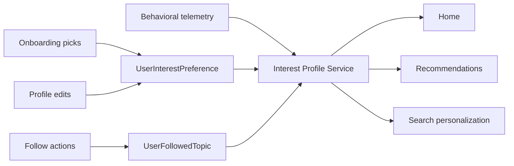

# User Interest and Follow System Technical Spec

**Source PRD**: `docs/features/user-interest-and-follow-system-prd.md`  
**Date**: 2026-03-22  
**Status**: Proposed  
**Owner**: Product + Personalization

## 1. Purpose

This spec defines the first production-ready user interest layer for Sportstrivia.

It introduces:
- explicit interest capture
- follow/unfollow for typed topics
- a deterministic interest profile service
- APIs that downstream discovery systems can call consistently

This system is designed to work with the existing `Topic` backbone and current telemetry sources.

## 2. Current State

### What already exists
- `User.favoriteTeams` stores freeform strings.
- `UserTopicStats` captures topic-level performance and recency.
- `SearchQuery` and `UserSearchQuery` capture search behavior.
- The quizzes page can bias toward one top topic via `getPersonalizedTopicSlug()`.
- `/api/users/me` and profile UI already support editing `favoriteTeams`.

### Current gaps
- there is no first-class sport preference
- there is no follow model
- explicit preferences are not tied to `Topic`
- onboarding does not collect discoverability preferences
- downstream consumers do not have a stable `interest profile` contract

### Explicit non-goals
Do not build:
- notification automation for followed entities
- ML ranking
- social feed mechanics

## 3. Decisions

### D1. Use typed `Topic` rows as the object of interest and follow
Users follow topics, not arbitrary strings.

### D2. Keep `favoriteTeams` for backward compatibility in v1
Do not remove `User.favoriteTeams` immediately. Migrate reads gradually to the new topic-based system.

### D3. Separate explicit interests from follows
These are not the same action.
- explicit interest = seed signal from onboarding/profile
- follow = durable user action with stronger weight

### D4. Compute interest profile on demand in v1
Do not add a materialized profile table in the first release. Use a cached service.

## 4. Target Architecture



## 5. Schema Changes

## 5.1 Prisma changes

### `UserInterestPreference`

```prisma
model UserInterestPreference {
  id         String                   @id @default(cuid())
  userId     String
  topicId     String
  source     UserInterestSource
  strength   Float                    @default(1)
  createdAt  DateTime                 @default(now())
  updatedAt  DateTime                 @updatedAt
  user       User                     @relation(fields: [userId], references: [id], onDelete: Cascade)
  topic      Topic                    @relation(fields: [topicId], references: [id], onDelete: Cascade)

  @@unique([userId, topicId, source])
  @@index([userId])
  @@index([topicId])
}
```

### `UserFollowedTopic`

```prisma
model UserFollowedTopic {
  id         String   @id @default(cuid())
  userId     String
  topicId    String
  createdAt  DateTime @default(now())
  user       User     @relation(fields: [userId], references: [id], onDelete: Cascade)
  topic      Topic    @relation(fields: [topicId], references: [id], onDelete: Cascade)

  @@unique([userId, topicId])
  @@index([userId, createdAt])
  @@index([topicId])
}
```

### `UserDiscoveryPreference`

```prisma
model UserDiscoveryPreference {
  userId               String      @id
  preferredDifficulty  Difficulty?
  preferredPlayModes   PlayMode[]
  onboardingCompletedAt DateTime?
  createdAt            DateTime    @default(now())
  updatedAt            DateTime    @updatedAt
  user                 User        @relation(fields: [userId], references: [id], onDelete: Cascade)
}
```

### `User` relation additions
Add:

```prisma
model User {
  ...
  interestPreferences  UserInterestPreference[]
  followedTopics       UserFollowedTopic[]
  discoveryPreference  UserDiscoveryPreference?
}
```

### `Topic` relation additions
Add:

```prisma
model Topic {
  ...
  interestedUsers UserInterestPreference[]
  followers       UserFollowedTopic[]
}
```

Enums:

```prisma
enum UserInterestSource {
  ONBOARDING
  PROFILE_EDIT
  IMPORT
}
```

Notes:
- `preferredPlayModes` uses existing `PlayMode` to avoid introducing a new format taxonomy now.
- If Prisma array support for enums is problematic in the deployed environment, fallback to `Json` or `String[]`. Prefer enum array first.

## 5.2 Follow eligibility rules
Only topics with these schema types can be followed in v1:
- `SPORT`
- `SPORTS_TEAM`
- `ATHLETE`
- `SPORTS_EVENT`
- `SPORTS_ORGANIZATION`

Rules:
- `NONE` topics are not followable.
- `entityStatus` should be `READY` before the follow button is shown in public UI.
- backend must still validate `schemaType` even if UI hides unsupported topics.

## 6. Interest Profile Contract

## 6.1 Output shape

```ts
type InterestProfile = {
  userId: string;
  generatedAt: string;
  explicit: Array<{
    topicId: string;
    slug: string;
    name: string;
    schemaType: string;
    score: number;
    source: "ONBOARDING" | "PROFILE_EDIT";
  }>;
  follows: Array<{
    topicId: string;
    slug: string;
    name: string;
    schemaType: string;
    score: number;
  }>;
  inferred: Array<{
    topicId: string;
    slug: string;
    name: string;
    schemaType: string;
    score: number;
    reasons: string[];
  }>;
  summary: {
    topSports: string[];
    topEntities: string[];
    preferredDifficulty?: string | null;
    preferredPlayModes: string[];
  };
};
```

## 6.2 Scoring heuristic

V1 deterministic score:

```text
finalScore =
  followWeight +
  explicitInterestWeight +
  topicPerformanceWeight +
  searchWeight +
  recencyWeight
```

Recommended defaults:
- follow: `+100`
- onboarding/profile explicit interest: `+60 * strength`
- `UserTopicStats.questionsAnswered`: `min(30, questionsAnswered * 0.75)`
- `UserTopicStats.successRate`: `successRate * 0.15`
- recent topic activity in last 30 days: `+0 to 20`
- matching `UserSearchQuery.timesSearched`: `min(20, timesSearched * 2)`

Rules:
- follows outrank explicit interests
- explicit interests outrank inferred behavior
- do not produce more than 20 entities in the default profile payload

## 7. Service Design

## 7.1 Files to add

- `lib/services/user-interest.service.ts`
- `lib/services/user-follow.service.ts`
- `lib/services/interest-profile.service.ts`
- `lib/validations/user-interest.schema.ts`

## 7.2 Existing files to extend

- `app/api/users/me/route.ts`
- `lib/services/user-profile.service.ts`
- `components/features/onboarding/PreOnboardingFlow.tsx` or replacement onboarding flow
- `app/profile/me/ProfileMeClient.tsx`
- `app/topics/[slug]/page.tsx`

## 7.3 Service responsibilities

### `user-interest.service.ts`
- create and update explicit interest selections
- replace onboarding selections atomically
- validate topic eligibility

### `user-follow.service.ts`
- follow topic
- unfollow topic
- list follows
- reject unsupported topic types

### `interest-profile.service.ts`
- read follows, explicit interests, topic stats, and search history
- compute normalized ranking
- return `InterestProfile`
- cache result for 5 to 15 minutes
- expose invalidation hooks after follow or preference mutations

## 8. API Changes

## 8.1 Profile APIs

### Extend `GET /api/users/me`
Include:
- `interestPreferences`
- `followedTopics`
- `discoveryPreference`

### Narrow `PATCH /api/users/me`
Keep basic profile edits here only:
- `name`
- `bio`
- `image`
- `favoriteTeams` for compatibility

Do not overload this endpoint with nested follow and interest mutations.

## 8.2 New interest APIs

### `GET /api/users/me/interests`
Returns explicit interests plus discovery preferences.

Response:
```json
{
  "interests": [
    {
      "topicId": "topic_1",
      "slug": "cricket",
      "name": "Cricket",
      "schemaType": "SPORT",
      "source": "ONBOARDING",
      "strength": 1
    }
  ],
  "preferences": {
    "preferredDifficulty": "MEDIUM",
    "preferredPlayModes": ["STANDARD"]
  }
}
```

### `PUT /api/users/me/interests`
Atomic replace for onboarding/profile save.

Request:
```json
{
  "topicIds": ["topic_sport_cricket", "topic_team_india"],
  "source": "ONBOARDING",
  "preferences": {
    "preferredDifficulty": "MEDIUM",
    "preferredPlayModes": ["STANDARD"]
  }
}
```

Behavior:
- replace all interest rows for that `source`
- upsert `UserDiscoveryPreference`
- invalidate interest profile cache

## 8.3 New follow APIs

### `POST /api/topics/[id]/follow`
Creates a follow.

Success:
```json
{
  "following": true,
  "topicId": "topic_team_india"
}
```

### `DELETE /api/topics/[id]/follow`
Deletes a follow.

### `GET /api/users/me/follows`
Returns all follows grouped by schema type.

Response:
```json
{
  "sports": [],
  "teams": [],
  "athletes": [],
  "events": [],
  "organizations": []
}
```

## 8.4 Interest profile API

### `GET /api/users/me/interest-profile`
Returns the deterministic merged profile for downstream use.

This endpoint is internal-product facing and may later be used by home, search, and recommendations.

## 9. UX Changes

## 9.1 Onboarding

Current state:
- `PreOnboardingFlow` is value-marketing only.

V1 implementation:
- keep the current pre-onboarding marketing flow if needed
- add a new authenticated interest capture step after sign-in or first-play gate
- make it skippable
- limit to 2 steps max

Step 1:
- pick favorite sports

Step 2:
- optionally pick favorite teams, athletes, or tournaments from the selected sports

V1 should not ask for too much.
Do not ask all of: sports, teams, athletes, tournaments, difficulty, and format on the first screen.

## 9.2 Profile

Replace the current freeform-only favorite teams experience with:
- favorite sports picker
- followed entities manager
- optional difficulty preference
- keep `favoriteTeams` visible only during migration if still needed

## 9.3 Topic pages

For typed entity pages:
- show `Follow` / `Following`
- show only when topic is follow-eligible and `entityStatus = READY`

## 10. Data Access Rules

## 10.1 Topic eligibility for explicit interests
Users can explicitly select only:
- sports
- teams
- athletes
- events
- organizations

## 10.2 Search and behavioral joins
Behavioral inference should map from:
- `UserTopicStats.topicId`
- `UserSearchQuery -> SearchQuery.query`

V1 query-to-topic inference for searches:
- exact slug match
- exact topic name match
- exact alias match
- optional prefix match for high-confidence alias terms

Do not build fuzzy inferred mapping in v1.

## 11. Migration Plan

## 11.1 Migration A: schema additions
Add:
- `UserInterestPreference`
- `UserFollowedTopic`
- `UserDiscoveryPreference`
- new `User` relations

## 11.2 Migration B: compatibility backfill
Backfill strategy:
- leave `favoriteTeams` untouched
- do not auto-convert freeform strings into topic follows
- optionally create `UserInterestPreference` rows only when a freeform string matches a unique team topic exactly

This backfill should be conservative. Bad inferred interests are worse than missing interests.

Backfill script:
- `scripts/users/backfill-explicit-interests.ts`

## 11.3 Migration C: cache invalidation hooks
On these events, clear interest-profile cache:
- follow
- unfollow
- onboarding interest save
- profile interest save
- significant topic stat update if needed later

## 12. Rollout Sequence

### Phase 1: backend foundation
- Prisma migration
- follow service
- explicit interest service
- interest profile service
- APIs

### Phase 2: profile surfaces
- profile editor support
- followed entities listing
- backward-compatible `favoriteTeams` handling

### Phase 3: onboarding capture
- add lightweight post-auth interest flow
- persist interests via `PUT /api/users/me/interests`

### Phase 4: entity pages
- ship follow buttons on eligible topic pages

### Phase 5: consumers
- home, recommendations, and search can consume `interest-profile`

## 13. Acceptance Criteria

### Backend
- users can follow and unfollow eligible topics
- users can save explicit interests tied to topic IDs
- the system returns a stable `InterestProfile` payload
- invalid topic types are rejected by API

### UX
- a new user can pick at least one sport during onboarding and see those interests saved
- an existing user can manage follows from profile and topic pages
- follow state is reflected immediately after mutation

### Compatibility
- existing `favoriteTeams` profile editing does not break during rollout
- downstream callers can adopt new APIs without requiring immediate removal of legacy fields

## 14. Open Questions

1. Should difficulty preference be part of MVP?
Decision: optional in schema, not required in onboarding.

2. Should play format be modeled using `PlayMode` or a separate taxonomy?
Decision: use `PlayMode` in v1 and revisit later.

3. Should sports be auto-followed when explicitly selected in onboarding?
Decision: no. Interests and follows remain separate.

## 15. Deferred Work

- notification settings for follows
- auto-follow suggestions
- confidence-based fuzzy mapping from search queries to topics
- materialized interest snapshots
- model-driven interest ranking
